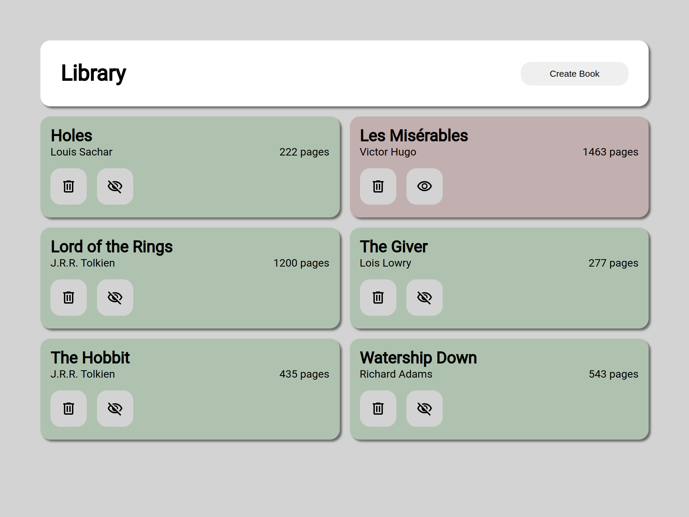
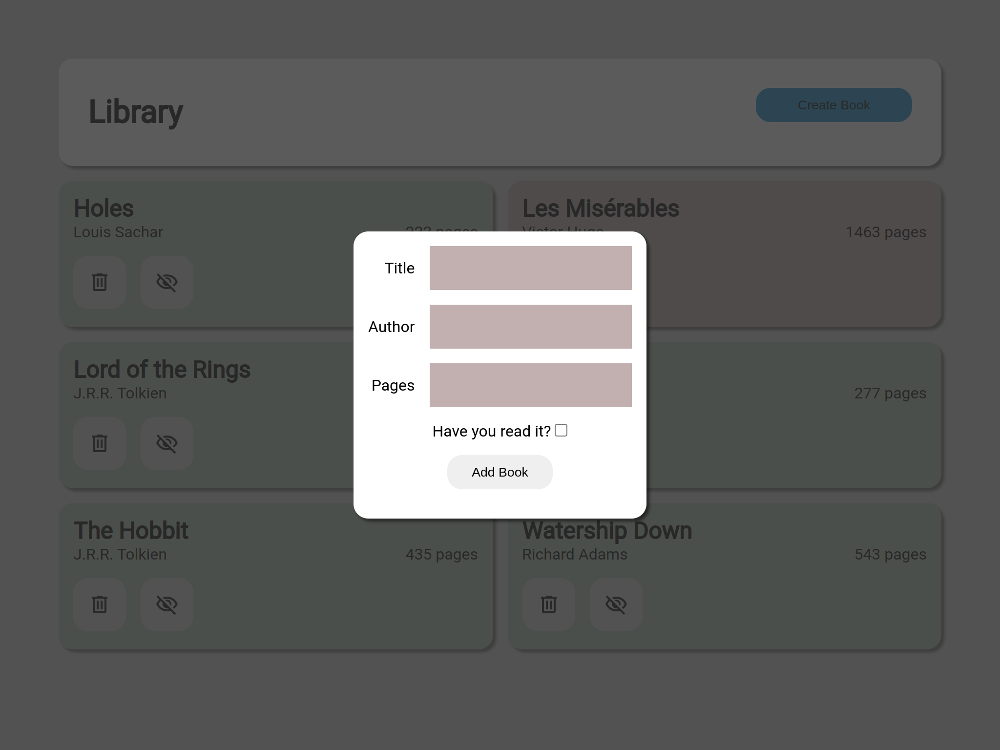

# The Odin Project: Library

A very simplistic book tracking application, written in Javascript for "The Odin Project.

> ⓘ TODO: I will take down my [Live Demo](https://odin-library-a64e9.web.app/) if the data starts to look like all of the other Odin Project examples. A possible solution for the future would be user authentication.

Books can be added, removed, and status between _Read_ and _Unread_ may be toggled.

There are two branches for this project.

The older version did not include data storage, and was writtin during the early lessons in the Javascript course. The source code for this can be found in the `original` branch.

The second, more recent version includes Firebase firebase BaaS functionality, which has now been merged into the `main` branch, and is what you see if you browse the source here on github.

## Screenshots

Here is what the application looks like at the main screen with some books added.

And here is what the site looks like after clicking on the 'Create Book' button, which pops open a modal to allow for data entry.

## Installation Instructions

### 1. Install required packages

Clone or otherwise acquire this repo, and run `npm install` to get the required packages.

### 2. Build the project

`npm run build` will build the project, or if you intend to make changes and want to continuously build those changes in real time: `npm run start`.

### 3. Update the BaaS Config

You will need to do some minimal Firebase setup. Visit the [Google Firebase Console](console.firebase.google.com) and ensure that you have a 'library' project created that has a Firebase Datastore and Hosting (optional) enabled.

From the project settings for the library project, copy the `firebaseConfig` object data into this project's `src/firebase.js` file, replacing the current key/value pairs.

Then deploy to Google Hosting, or run locally.

### 4. Serve the content

`firebase deploy --except functions` to deploy to Google's hosting, or `firebase serve --only hosting` to run locally.
